# DeepLense Test Tasks

This repository contains my implementations and documentation for the ML4Sci GSoC 2026 application test tasks, focusing on DeepLense, for the project [Physics-Informed Diffusion Models for Gravitational Lensing Simulation](https://ml4sci.org/gsoc/2026/proposal_DEEPLENSE8.html) and [Physics Guided Machine Learning on Real Lensing Images
](https://ml4sci.org/gsoc/2026/proposal_DEEPLENSE5.html)

The work spans supervised lens classification, physics-informed modeling, and diffusion-based generation.

Common task I, specific task VII for 'Physics Guided Machine Learning on Real Lensing Images'.

Common task I, specific task VII and specific task VIII for 'Physics-Informed Diffusion Models for Gravitational Lensing Simulation'.

## Common Task I (Transfer Learning Classification)

- **Notebook:** [common-task-i/DeepLense_common_task_i.ipynb](common-task-i/DeepLense_common_task_i.ipynb)
- **Summary:** Multi-class classification of lensing images (`no`, `sphere`, `vort`) using ImageNet-pretrained CNN backbones.
- **Best Model:** DenseNet121
- **Best Validation Accuracy:** **96.27%**
- **Best Macro AUC:** **0.9956**

### Result Visuals

ResNet50:

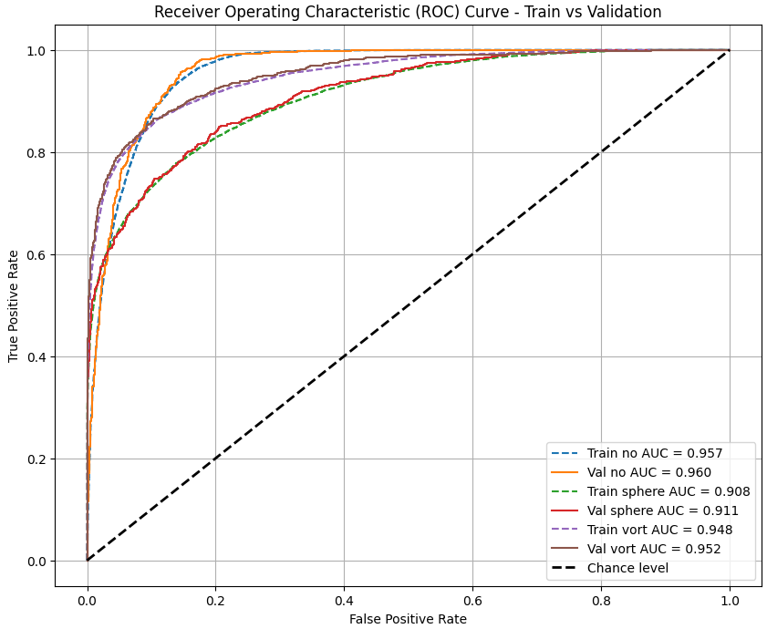

EfficientNet:

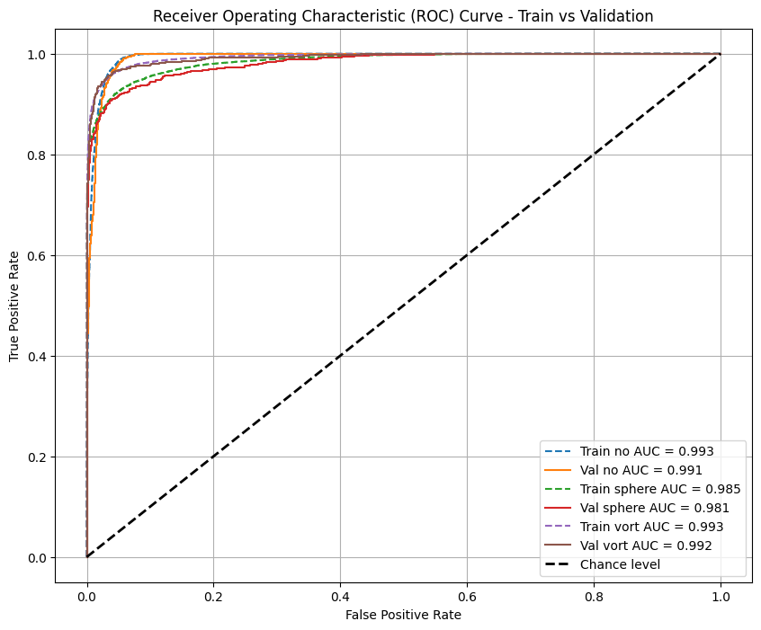

DenseNet:

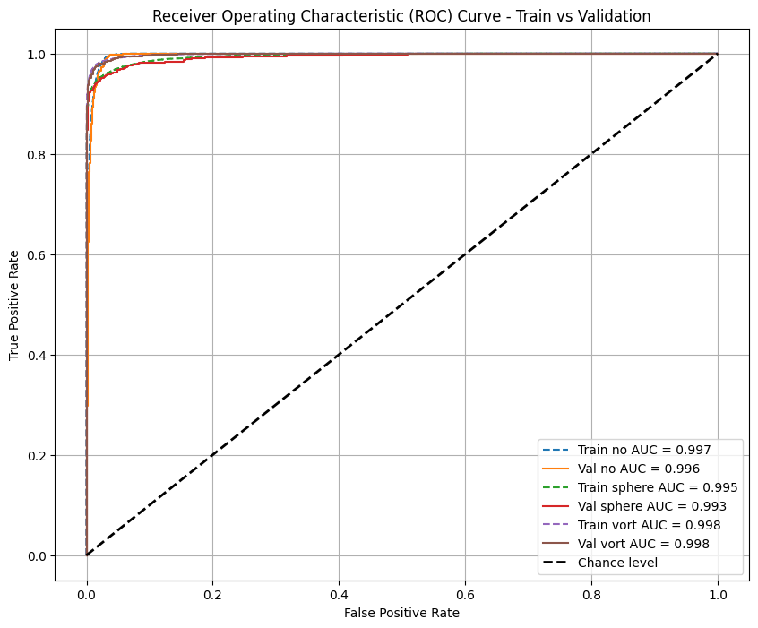

MobileNet:

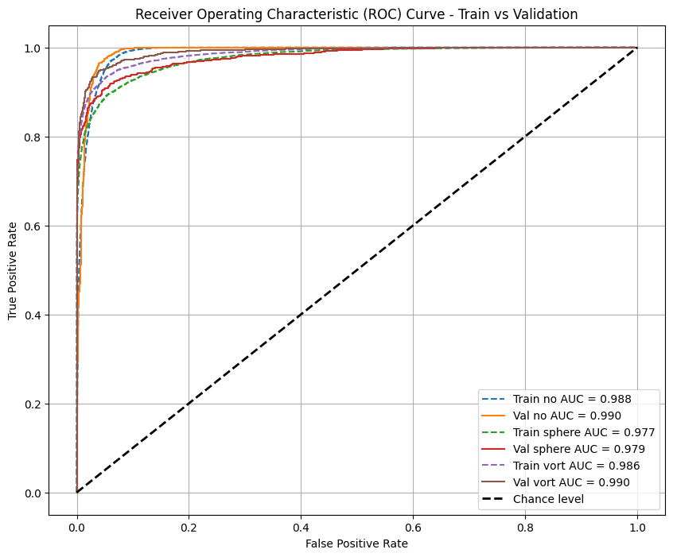

## Task VII (Physics-Informed Neural Network Classification)

- **Notebook:** [task-vii/DeepLense_task_vii.ipynb](task-vii/DeepLense_task_vii.ipynb)
- **Summary:** PINN-style classification combining CNN features with physics constraints from gravitational lensing equations.
- **Models:** EfficientNet-PINN, DenseNet-PINN
- **Reported Performance:**
	- EfficientNet-PINN: Accuracy approx. **0.938**, Macro AUC approx. **0.990**
	- DenseNet-PINN: Accuracy approx. **0.965**, Macro AUC approx. **0.9957**

### Result Visuals

EfficientNet PINN:

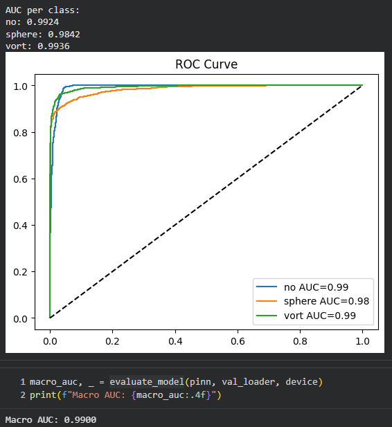

 
DenseNet PINN:

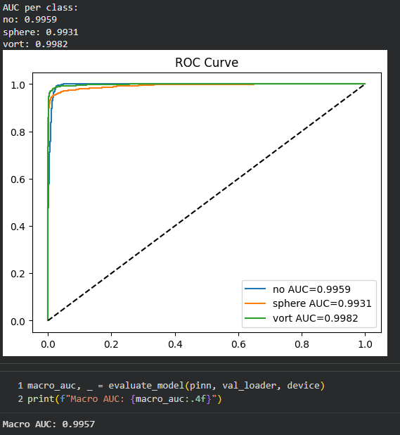

## Task VIII (Diffusion Model for Lensing Generation)

- **Notebook:** [task-viii/DeepLense_task_viii.ipynb](task-viii/DeepLense_task_viii.ipynb)
- **Summary:** DDPM-based generative modeling of strong lensing structures with a UNet diffusion backbone.
- **Reported FID:** approx. **2.34**

### Generated Samples

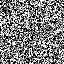
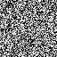
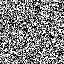
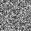

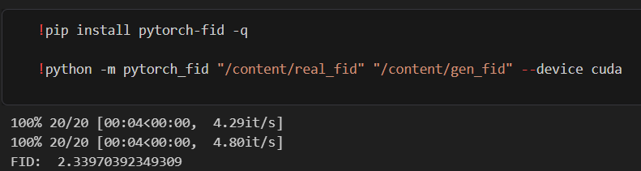

## Task READMEs
- [Common Task I README](common-task-i/README.md)
- [Task VII README](task-vii/README.md)
- [Task VIII README](task-viii/README.md)

