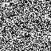

# DeepLense Task VIII : Diffusion Model for Gravitational Lensing

This project implements a **Denoising Diffusion Probabilistic Model (DDPM)** to generate realistic **strong gravitational lensing images** from the DeepLense dataset.

The model learns to generate lensing patterns by **iteratively denoising Gaussian noise** using a **UNet-based diffusion architecture**. 

Notebook: [DeepLense_task_viii.ipynb](DeepLense_task_viii.ipynb)

## Model

**Input channels (4):**
- Lensing image
- Radial distance channel
- X coordinate grid
- Y coordinate grid

**Architecture**
- Sinusoidal timestep embedding  
- Residual blocks + GroupNorm  
- Self-attention bottleneck  
- UNet downsampling / upsampling  
- EMA weights for stable sampling

Training objective: predict the **noise added at timestep `t`**.

## Training

| Parameter | Value |
|---|---|
| Image size | 64×64 |
| Diffusion steps | 1000 |
| Batch size | 32 |
| Optimizer | AdamW |
| Learning rate | 2e-4 |
| Train split | 90% |
| Validation split | 10% |

## Evaluation

Image quality is measured using **Fréchet Inception Distance (FID)** between generated and real images.

**Result**
FID ≈ 2.34

This indicates strong similarity between generated and real lensing samples.

## Diffusion Generation Examples

Noise -> gravitational lens structure

25 Diffusion Generated Examples:
[diffusion_gifs](diffusion_gifs)